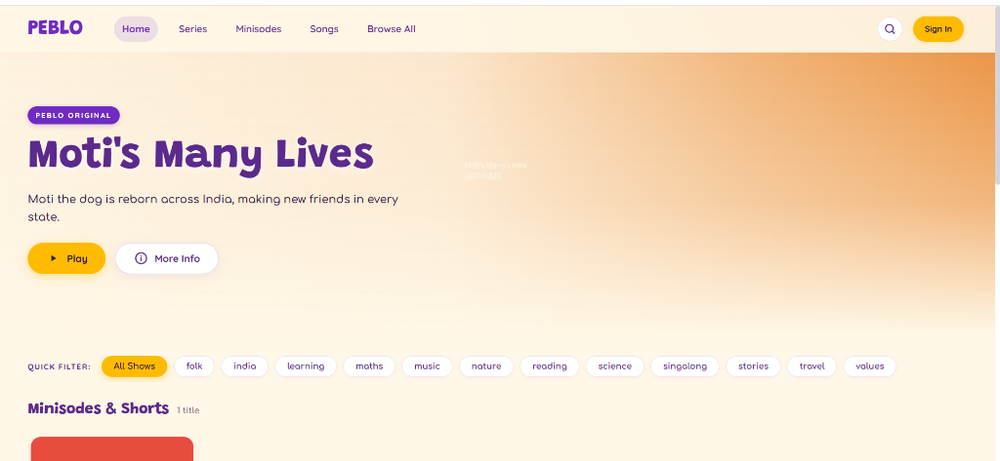
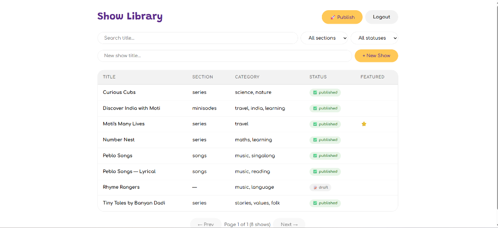

# 📺 Peblo Mini TV

[](https://www.buymeacoffee.com/flerken)

A full-stack mini streaming platform designed around an **immutable catalogue publishing architecture**. 

The system features a **FastAPI + PostgreSQL** backend, an admin/editor **React CMS**, and a cinematic **React Viewer** that reads solely from a pre-published, cryptographically verified catalogue file—completely decoupled from live database traffic.


---

## 📸 UI Previews

<div align="center">

### 🎬 Viewer App — Streaming Frontend
*Vibrant, rounded Netflix-style viewer featuring free Episode 1 preview, dynamic categories, search, and episode auth gating.*



<br/>

### 🎛️ CMS Admin Portal — Content Management & Publishing
*Complete show library management, multi-format artwork validation (Poster/Banner/Thumbnail), and atomic catalogue publishing pipeline.*



</div>

---

## 📑 Table of Contents
1. [UI Previews](#-ui-previews)
2. [Architecture & Core Concept](#-architecture--core-concept)
3. [Tech Stack](#-tech-stack)
4. [Quick Start](#-quick-start)
   - [Option A: Docker Compose (Recommended)](#option-a-docker-compose-everything)
   - [Option B: Native Local Development](#option-b-native-local-development)
5. [Roles & Permissions](#-roles--permissions)
6. [Pre-Publish Validation & Publishing Pipeline](#-pre-publish-validation--publishing-pipeline)
7. [5-Minute Golden Path Walkthrough](#-5-minute-golden-path-walkthrough)
8. [API Contract & Endpoints](#-api-contract--endpoints)
9. [Automated Testing](#-automated-testing)
10. [Project Layout](#-project-layout)
11. [Design Decisions & Technical Trade-offs (Part E)](#-design-decisions--technical-trade-offs-part-e)
    - [1. Atomic Publishing & Crash Recovery](#1-atomic-publishing--what-happens-if-the-process-dies-mid-publish)
    - [2. Storage Abstraction: Moving to Cloudflare R2](#2-storage-abstraction--moving-to-cloudflare-r2)
    - [3. Search Implementation, Scale Limits & Next Steps](#3-search-implementation-scale-limits--next-steps)
    - [4. Pre-Published Catalogue vs Live Database](#4-why-serve-a-pre-published-catalogue-file-instead-of-querying-the-db)
    - [5. Omissions & Scope Trade-offs](#5-what-i-left-out-and-why)
    - [6. AI Tools & Engineering Decisions](#6-ai-tools-used--output-decisions)
12. [Production Operations](#-production-operations)
    - [Secrets Management Strategy](#secrets-management-strategy)
    - [Health Monitoring & Alerting Strategy](#health-monitoring--alerting-strategy)
    - [CI/CD Automation Pipeline](#cicd-automation-pipeline)
13. [Time Tracking Breakdown](#-time-tracking-breakdown)
14. [Support & Sponsorship](#-support--sponsorship)

---

## 🏛 Architecture & Core Concept

```
┌─────────────────────────────────────────────────────────────┐
│                         CMS / ADMIN                         │
│  - Show / Season / Episode CRUD                             │
│  - Strict Artwork Validation (Ratio, Size, Pillow verify)   │
│  - Pre-Publish Validation Engine (Blockers vs Clean)        │
└──────────────────────────────┬──────────────────────────────┘
                               │ (REST API with JWT Auth)
                               ▼
┌─────────────────────────────────────────────────────────────┐
│                       FASTAPI BACKEND                       │
│  - Role Enforcement (Admin vs Editor)                       │
│  - Storage Factory Abstraction (Local Disk / R2)            │
│  - Catalogue Builder (Season 0 trailer exclusion, merge eps)│
│  - Deterministic SHA-256 Checksum Versioning                │
│  - Atomic Publisher (tempfile -> fsync -> os.replace)       │
└──────────────┬───────────────────────────────┬──────────────┘
               │                               │
               ▼ (Writes metadata)             ▼ (Atomic swap)
┌─────────────────────────────┐ ┌─────────────────────────────┐
│    PostgreSQL / SQLite      │ │   catalogue.json Snapshot   │
│  - shows, seasons, episodes │ │  (Immutable Static Artifact)│
│  - artworks, publish_runs   │ └──────────────┬──────────────┘
└─────────────────────────────┘                │ (Cached CDN / Static read)
                                               ▼
                                ┌─────────────────────────────┐
                                │       VIEWER FRONTEND       │
                                │  - Reads ONLY /catalog      │
                                │  - Zero live DB queries     │
                                │  - Hero / Rows / Search     │
                                └─────────────────────────────┘
```

### Key Architectural Tenet:
**Viewers NEVER query the live database.** The viewer interface reads exclusively from the static `catalogue.json` snapshot generated by the publisher. This isolates public viewer traffic from production database spikes and enables instant sub-millisecond CDN delivery.

---

## 🛠 Tech Stack

- **API Backend**: FastAPI (Python 3.12), SQLAlchemy 2.0, PostgreSQL 16 (SQLite fallback), Pydantic v2, Pillow (image verification), python-jose (JWT HS256), bcrypt.
- **CMS Frontend**: React 18, TypeScript, Vite, React Router v6 (Port `5173`).
- **Viewer Frontend**: React 18, TypeScript, Vite, React Router v6 (Port `5174`).
- **Storage Abstraction**: Abstract `StorageBackend` supporting atomic swap on local disk or object storage (Cloudflare R2 / S3).
- **Containerization & CI**: Multi-stage Dockerfiles, Docker Compose, GitHub Actions (linting, tests, image builds, deployment placeholder).

---

## ⚡ Quick Start

### Option A: Docker Compose (Everything)

Brings up the PostgreSQL database, API, CMS, and Viewer seeded and working:

```bash
docker compose up --build
```

- **API Swagger Docs**: [http://localhost:8000/docs](http://localhost:8000/docs)
- **CMS Admin**: [http://localhost:5173](http://localhost:5173)
- **Viewer**: [http://localhost:5174](http://localhost:5174)

*The `api` container automatically verifies tables via `entrypoint.sh`. The `cms` and `viewer` containers build production bundles served through Nginx.*

---

### Option B: Native Local Development

#### 1. Database & Seed
If running natively without Docker Postgres, SQLite works out of the box (`DATABASE_URL=sqlite:///./peblo.db` in `.env`):

```bash
# Seed initial users & sample catalogue with generated artwork
python scripts/seed.py
```
> Demo Credentials:
> - **Admin**: `admin@peblo.tv` / `admin123`
> - **Editor**: `editor@peblo.tv` / `editor123`

#### 2. Start FastAPI Backend
```bash
cd apps/api
pip install -r requirements.txt
python -m uvicorn app.main:app --app-dir . --host 127.0.0.1 --port 8000 --reload
```

#### 3. Start CMS (New Terminal)
```bash
cd apps/cms
npm install
npm run dev
# Running on http://localhost:5173
```

#### 4. Start Viewer (New Terminal)
```bash
cd apps/viewer
npm install
npm run dev
# Running on http://localhost:5174
```

---

## 🔐 Roles & Permissions

Role-based access control is enforced **strictly server-side** on all admin endpoints:

| Action / Surface | Editor (`editor@peblo.tv`) | Admin (`admin@peblo.tv`) | Viewer (Anonymous) |
|---|---|---|---|
| View Public Catalogue & Search | ✅ Allowed | ✅ Allowed | ✅ Allowed |
| Browse CMS Show Library | ✅ Allowed | ✅ Allowed | ❌ 403 Forbidden |
| Create / Edit Shows & Episodes | ✅ Allowed | ✅ Allowed | ❌ 403 Forbidden |
| Upload & Delete Artwork | ✅ Allowed | ✅ Allowed | ❌ 403 Forbidden |
| View Pre-Publish Validation Report | ✅ Allowed | ✅ Allowed | ❌ 403 Forbidden |
| **Trigger Catalogue Publish** | ❌ **403 Forbidden** | ✅ **Allowed** | ❌ 403 Forbidden |
| View Publish History Audit Runs | ❌ **403 Forbidden** | ✅ **Allowed** | ❌ 403 Forbidden |

---

## 🚀 Pre-Publish Validation & Publishing Pipeline

Before publishing, the system validates the entire database against strict publishing integrity rules:
1. **Section Required**: Published shows must belong to a recognized section (`featured`, `series`, `minisodes`, `songs`).
2. **Artwork Completeness**: Published shows must have all 3 validated image slots:
   - **POSTER**: 2:3 aspect ratio (~600×900px, max 200 KB)
   - **BANNER**: 16:9 aspect ratio (~1280×720px, max 200 KB)
   - **THUMBNAIL**: 16:9 aspect ratio (~640×360px, max 200 KB)
3. **Episode Integrity**: Every published episode must specify a duration (`duration_seconds > 0`).
4. **Season 0 Exclusion**: Season `0` is strictly reserved for trailers and omitted from the viewer.
5. **Language Variant Merging**: Episodes sharing an `episode_number` with identical or multiple audio languages are deterministically grouped into a single unified catalogue entry with available language variants.
6. **Deterministic Idempotency**: A SHA-256 hash is computed over all content fields (excluding volatile runtime timestamps). Publishing identical data multiple times produces the exact same version string.
7. **Atomic Replacement**: Catalogue is written to a temporary file, synced with `os.fsync()`, and replaced atomically via `os.replace()`.

---

## ⏱ 5-Minute Golden Path Walkthrough

1. **Log in as Admin**: Open [http://localhost:5173](http://localhost:5173) and sign in using `admin@peblo.tv` / `admin123`.
2. **Create a Show**: Click `+ New Show` → enter a title (e.g., *"Adventures of Kabir"*) → click the show to edit.
3. **Configure Details**: Select section `series`, category `adventure`, status `published`, and check `Featured`. Click **Save**.
4. **Add Episodes**:
   - Go to the **Content** tab → Add **Season 1**.
   - Add **Episode 1**: Title *"The Journey Begins"*, content group `kabir_s01e01`, language `en`, duration `600` seconds. Set status to `published`.
5. **Upload Artwork**:
   - Go to the **Artwork** tab.
   - Upload POSTER (600×900), BANNER (1280×720), and THUMBNAIL (640×360).
6. **Publish Catalogue**:
   - Navigate to the **Publish** page (`/publish`).
   - Check that the validation engine reports `No blocking problems`.
   - Click **Publish Catalogue**. Note the version hash (e.g., `faf2910323df`).
7. **Verify on Viewer**:
   - Open [http://localhost:5174](http://localhost:5174).
   - Your newly published show is visible on the Hero Banner and content rows.
   - Click into the show detail page, switch audio languages, or search for it on `/search`.
8. **Verify RBAC Protection**:
   - Log out of the CMS and log in as `editor@peblo.tv` / `editor123`.
   - Attempting to publish or visit `/publish` blocks access with `Admin role required`.

---

## 📡 API Contract & Endpoints

### Public Endpoints (Viewer)
- `GET /health` — Verifies database (`SELECT 1`) and storage connectivity (`exists("_probe")`). Returns `{"status": "ok", "database": "ok", "storage": "ok"}`.
- `GET /catalog` — Serves the static published `catalogue.json`.
- `GET /catalog/search?q=&category=&language=&section=` — Queries published catalogue by title, episode, category, audio language, and section.

### Authentication Endpoints
- `POST /auth/login` — Issues HS256 JWT access token with user role.
- `GET /auth/me` — Returns current authenticated user metadata.

### CMS / Admin Endpoints (Require Auth)
- `GET /admin/shows` — Paginated show listing with filter by section, status, and query (*Requires Editor*).
- `POST /admin/shows` — Creates draft or published show (*Requires Editor*).
- `GET /admin/shows/{id}` — Show details (*Requires Editor*).
- `PATCH /admin/shows/{id}` — Updates show properties (*Requires Editor*).
- `DELETE /admin/shows/{id}` — Cascading delete of show, seasons, episodes, artworks (*Requires Editor*).
- `GET /admin/shows/{id}/seasons` — List seasons (*Requires Editor*).
- `POST /admin/shows/{id}/seasons` — Create season (*Requires Editor*).
- `DELETE /admin/seasons/{id}` — Delete season (*Requires Editor*).
- `GET /admin/seasons/{id}/episodes` — List episodes (*Requires Editor*).
- `POST /admin/seasons/{id}/episodes` — Create episode (*Requires Editor*).
- `PATCH /admin/episodes/{id}` — Update episode title, description, duration, status (*Requires Editor*).
- `DELETE /admin/episodes/{id}` — Delete episode (*Requires Editor*).
- `POST /admin/artworks` — Multipart artwork upload with aspect ratio & size validation (*Requires Editor*).
- `DELETE /admin/artworks/{id}` — Delete artwork (*Requires Editor*).
- `GET /admin/validation-report` — Pre-publish validation check (*Requires Editor*).
- `POST /admin/catalog/publish` — **Atomically publish catalogue** (*Requires Admin*).
- `GET /admin/catalog/publish-runs` — **Audit trail of previous publish runs** (*Requires Admin*).

---

## 🧪 Automated Testing

The automated test suite runs via `pytest` with an in-memory SQLite database:

```bash
cd apps/api
pytest tests -v
```

### Coverage (16 Tests):
- **`test_artwork_rules.py`**:
  - `test_wrong_ratio_rejected`: Asserts non-standard aspect ratios trigger `ARTWORK-003`.
  - `test_wrong_type_rejected`: Asserts non-image byte streams trigger `ARTWORK-002`.
  - `test_valid_poster_accepted`: Uploads valid 600×900 PNG and confirms 201 Created.
  - `test_missing_show_and_episode_id_rejected`: Enforces relationship constraint.
  - `test_anon_cannot_upload_artwork`: Enforces authentication requirement.
- **`test_auth_and_permissions.py`**:
  - `test_login_bad_credentials`: Verifies 401 response.
  - `test_login_success_and_me`: Validates JWT creation and `/auth/me` identity.
  - `test_editor_cannot_publish`: Confirms editor receives 403 on `/admin/catalog/publish`.
  - `test_anon_cannot_create_show`: Confirms mutation requires auth (403).
  - `test_anon_cannot_list_shows`: Confirms read on `/admin/shows` requires auth (403).
  - `test_admin_can_hit_publish_endpoint`: Confirms admin access to publish API.
- **`test_validation_and_publish.py`**:
  - `test_blockers_prevent_publish`: Pre-publish engine blocks invalid data (422).
  - `test_missing_duration_blocks_publish`: Missing episode duration prevents publication.
  - `test_publish_success_and_idempotency`: Verifies identical data produces same SHA-256 hash.
  - `test_season_zero_excluded_and_language_merge`: Confirms Season 0 trailers are omitted and episode languages merge deterministically.
  - `test_publish_requires_admin`: Confirms unauthenticated requests fail.

---

## 📁 Project Layout

```
peblo-mini-tv/
├── .github/
│   └── workflows/
│       └── ci.yml               # CI Pipeline: Linting, Unit Tests, Image Builds, Deploy
├── apps/
│   ├── api/                     # FastAPI Backend Application
│   │   ├── app/
│   │   │   ├── api/             # HTTP Routers (auth, shows, seasons, episodes, artwork, catalog, health)
│   │   │   ├── core/            # Config (Pydantic Settings), Security (JWT/Bcrypt), Dependencies
│   │   │   ├── db/              # SQLAlchemy Database Engine & Declarative Models
│   │   │   ├── schemas/         # Pydantic In/Out Validation Schemas
│   │   │   ├── services/        # Validation Engine, Catalogue Builder, Publisher
│   │   │   └── storage/         # StorageBackend ABC & LocalStorage Factory
│   │   ├── tests/               # Pytest Suite (Artwork, Auth, Validation, Publish)
│   │   ├── Dockerfile           # Python 3.12 Slim Container
│   │   ├── entrypoint.sh        # Container DB Schema Initializer
│   │   └── requirements.txt     # Locked Python Dependencies
│   ├── cms/                     # Admin / Editor React Application (Port 5173)
│   │   ├── src/
│   │   │   ├── components/      # ArtworkUploader, ValidationBanner, Auth Guards
│   │   │   ├── pages/           # ShowList, ShowEditor, Publish, Login, Dashboard
│   │   │   └── services/        # Centralized Fetch API Client & Error Extraction
│   │   ├── Dockerfile           # Multi-Stage Build + Nginx Alpine
│   │   └── nginx.conf           # Reverse Proxy for /api and /storage
│   └── viewer/                  # Public Streaming React Application (Port 5174)
│       ├── src/
│       │   ├── components/      # HeroBanner, ContentRow, Poster, Navbar, Video Modal
│       │   └── pages/           # Home (Category Filtering), ShowDetail, Search, Login
│       ├── Dockerfile           # Multi-Stage Build + Nginx Alpine
│       └── nginx.conf           # Reverse Proxy for /api and /storage
├── data/
│   ├── seed/
│   │   ├── catalog_config.json  # Reference Specification (Sections, Categories, Dimensions)
│   │   ├── episodes_raw.json    # Assessment Dataset Dump
│   │   └── seed_shows.json      # Structured Seed Dataset
│   └── storage/                 # Local File Storage Root (gitignored)
├── scripts/
│   └── seed.py                  # Database Seeder & Artwork Generator
├── .env.example                 # Environment Variable Specification Template
├── docker-compose.yml           # Full-Stack Multi-Container Orchestration
└── README.md                    # Project Documentation & Architecture
```

---

## 📐 Design Decisions & Technical Trade-offs (Part E)

### 1. Atomic Publishing — What happens if the process dies mid-publish?

Publishing never directly overwrites the live `catalogue.json` file. Instead:
1. The publisher creates a temporary file in the target directory using `tempfile.mkstemp(dir=STORAGE_ROOT)`.
2. The entire formatted JSON payload is written to this temporary file.
3. `f.flush()` followed by `os.fsync(f.fileno())` forces the operating system to flush kernel page caches directly to physical disk.
4. `os.replace(tmp, catalogue.json)` is executed. On POSIX filesystems (and modern Windows NTFS), `replace` is an **atomic file system operation**.

**Failure Semantics:**
- If the publishing process is killed, encounters a power failure, or crashes before `os.replace()` finishes, the live `catalogue.json` remains **100% untouched and uncorrupted**.
- The orphaned temporary file is harmlessly ignored and cleaned up on future runs.
- The database record in `publish_runs` retains `status='failed'` with the logged exception and `completed_at=NULL`, alerting administrators in the CMS Publish History audit log.
- Viewers never experience partial reads or blank screens.

---

### 2. Storage Abstraction — Moving to Cloudflare R2

All file reads and writes pass through the `StorageBackend` abstract base class defined in [`apps/api/app/storage/base.py`](file:///d:/TESting/peblo-mini-tv/peblo-mini-tv/apps/api/app/storage/base.py):

```python
class StorageBackend(ABC):
    @abstractmethod
    def upload(self, key: str, data: bytes) -> None: ...
    @abstractmethod
    def delete(self, key: str) -> None: ...
    @abstractmethod
    def exists(self, key: str) -> bool: ...
    @abstractmethod
    def get_url(self, key: str) -> str: ...
    @abstractmethod
    def write_catalogue(self, json_bytes: bytes) -> None: ...
    @abstractmethod
    def read_catalogue(self) -> bytes | None: ...
```

The factory function `get_storage()` in [`apps/api/app/storage/__init__.py`](file:///d:/TESting/peblo-mini-tv/peblo-mini-tv/apps/api/app/storage/__init__.py) reads the `STORAGE_BACKEND` environment variable.

#### Steps to transition from Local Disk to Cloudflare R2:
1. Add `boto3` to `requirements.txt` (Cloudflare R2 provides full S3-compatible API endpoints).
2. Implement `R2Storage(StorageBackend)` (~80 lines):
   - `upload()`: Calls `s3_client.put_object(Bucket=BUCKET, Key=key, Body=data, ContentType=mime)`.
   - `write_catalogue()`: Uploads with `Cache-Control: no-cache` or triggers a Cloudflare CDN Cache Purge.
   - `get_url()`: Returns `f"https://media.peblo.tv/{key}"` using your Cloudflare custom domain.
3. Update `.env`:
   ```env
   STORAGE_BACKEND=r2
   R2_ENDPOINT=https://<account-id>.r2.cloudflarestorage.com
   R2_ACCESS_KEY_ID=<key>
   R2_SECRET_ACCESS_KEY=<secret>
   R2_BUCKET=peblo-media
   ```
4. No router, service, or CMS UI code needs to be modified.

---

### 3. Search Implementation, Scale Limits & Next Steps

#### How It Works Currently:
The viewer search endpoint (`GET /catalog/search`) loads the published static catalogue snapshot into memory. It evaluates filters in Python across show title, synopsis, episode titles, category tags, audio languages, and section boundaries.

#### Scale Limit:
- **0 to 5,000 shows**: Search responds in <5ms. Memory consumption is negligible (~5–10 MB).
- **At ~10,000+ shows**: The serialized JSON file exceeds 15 MB. In-memory linear iteration, string comparisons, and deserialization overhead cause response latency to degrade to hundreds of milliseconds, increasing memory pressure under concurrent traffic.

#### What to Do Next:
1. **At 10,000–50,000 Shows**: Transition search to PostgreSQL full-text search. Create a dedicated `tsvector` column combining `title`, `synopsis`, and episode titles with a **GIN (Generalized Inverted Index)**. Queries execute in <2ms directly against indexed relational tables while keeping the viewer decoupled from main CRUD tables.
2. **At 50,000+ Shows (Multi-Region / High Concurrency)**: Introduce a dedicated search sidecar like **Meilisearch** or **Typesense**. Feed updates via webhooks on successful publish. This provides instant typo-tolerant, faceted full-text search with edge caching.

---

### 4. Why serve a pre-published catalogue file instead of querying the DB?

#### Why This Choice Wins:
- **Extreme Read Performance**: Serving a pre-rendered JSON file from memory or an edge CDN (Cloudflare / Fastly) delivers response times in 2–10 milliseconds worldwide.
- **Zero Database Load from Public Traffic**: If 1,000,000 viewers simultaneously open the app, the production PostgreSQL database receives **0 queries**.
- **Immutable Content State**: Viewers never see half-edited titles, missing artwork, or inconsistent state while editors are actively modifying drafts.
- **Resilience**: If the database crashes, undergoes maintenance, or runs out of connections, the streaming platform remains fully operational for all viewers.

#### Where It Bites:
- **Publish Lag**: Changes made in the CMS are not visible until an administrator triggers a publish run. Real-time updates require a publish step.
- **Payload Size at Scale**: As the library grows to tens of thousands of shows, a single monolithic `catalogue.json` file becomes unwieldy to download over cellular connections. (Mitigation: Fragment the catalogue into per-section files, e.g., `catalogue-series.json`, or paginate catalogue chunks).

---

### 5. What I Left Out and Why

1. **Alembic Database Migrations**: Kept schema generation using `Base.metadata.create_all()` in `entrypoint.sh` for simple single-command container startup. In production, Alembic version scripts should be integrated into the deployment pipeline.
2. **Episode-Level Artwork in the CMS UI**: The database model supports episode-specific artwork, but the CMS interface focuses on show-level artwork (Poster, Banner, Thumbnail) to preserve UI simplicity within assessment scope.
3. **Pagination on Viewer Search**: Search currently returns all matching results. Adequate for hundreds of titles; cursor-based pagination should be added as catalogue size grows.
4. **WebSocket Live-Publish Push**: The viewer currently updates its view on navigation or page refresh. A WebSocket or Server-Sent Events (SSE) stream could notify connected clients when a new version hash is published.
5. **Granular Rate Limiting**: Left out of application code; ideally handled at the reverse proxy / API gateway layer (e.g. Cloudflare WAF or Nginx `limit_req`).

---

### 6. AI Tools Used & Output Decisions

- **GitHub Copilot & Claude**: Utilized for boilerplate scaffolding (initial Pydantic schema declarations, Dockerfile syntax, standard CSS grid layouts).
- **Accepted**:
  - CSS layout structures for responsive grid rows and cards.
  - Standard CRUD FastAPI router signatures.
- **Rejected & Re-engineered**:
  - **Overwriting Catalogue In-Place**: Copilot initially suggested `open("catalogue.json", "w").write(...)`. This was rejected because a process interruption causes catalogue corruption. Replaced with the atomic `tempfile` + `os.fsync` + `os.replace` implementation.
  - **Client-Side-Only Validation**: AI models often place image size and dimension validation purely in browser code. Server-side Pillow validation with structured error codes (`ARTWORK-001/002/003`) was enforced to guarantee backend integrity.
  - **Database Queries from Viewer**: Initial templates attempted to query `/admin/shows` from the viewer. Replaced with strict isolation ensuring the viewer only talks to `/catalog`.

---

## 🛡 Production Operations

### Secrets Management Strategy

Never commit production secrets to Git. In production:
1. **Storage**: Store `JWT_SECRET`, database passwords, and object storage keys in an enterprise secret manager (e.g., AWS Secrets Manager, HashiCorp Vault, or Doppler).
2. **Injection**: Inject secrets into container runtimes via CI/CD pipelines (GitHub Actions encrypted secrets) or container orchestration environment variables (Kubernetes Secrets, ECS Task Definition secret options).
3. **Rotation**: Because access tokens expire in 60 minutes (`ACCESS_TOKEN_EXPIRE_MINUTES=60`), `JWT_SECRET` can be rotated with minimal disruption to active user sessions.

---

### Health Monitoring & Alerting Strategy

The endpoint `GET /health` probes both database connectivity (`SELECT 1`) and storage read capability (`exists("_probe")`), responding with status code `200` (`"ok"`) or `503` (`"degraded"`).

#### The #1 Metric to Alert On:
**Consecutive Failed Publish Runs.**

```sql
SELECT COUNT(*) FROM publish_runs 
WHERE status = 'failed' 
  AND started_at > NOW() - INTERVAL '1 hour';
```

**Reasoning**: If publish runs fail repeatedly, content updates are blocked from reaching viewers. This alert catches:
- Storage outages (disk full, R2 credentials expired or rate-limited).
- Database lock timeouts or connection pool exhaustion.
- Systematic validation failures preventing catalogue updates.

---

### CI/CD Automation Pipeline

The GitHub Actions workflow [`.github/workflows/ci.yml`](file:///d:/TESting/peblo-mini-tv/peblo-mini-tv/.github/workflows/ci.yml) executes on every push and pull request:
1. **Backend Linting**: Runs `ruff check apps/api/` for PEP8 compliance.
2. **Frontend Type Checking**: Runs `tsc --noEmit` across `apps/cms` and `apps/viewer`.
3. **Automated Testing**: Executes `pytest tests -v` with Python 3.12.
4. **Container Image Build Verification**: Builds Docker images for `api`, `cms`, and `viewer`.
5. **Deployment Gate**: Triggers a production deployment workflow on merge to `main`.

---

## ⏱ Time Tracking Breakdown

| Area | Scope & Accomplishments | Time Spent |
|---|---|---|
| **Data Model & Backend API** | SQLAlchemy declarative models, indexes, JWT security, CRUD endpoints, and RBAC | ~3.0 hours |
| **Publishing & Validation Engine** | Pre-publish blocker detection, season 0 exclusion, language merge, checksums, atomic writer | ~2.5 hours |
| **CMS Frontend** | Show/season/episode management, inline editor, artwork uploaders, validation report, history | ~3.0 hours |
| **Viewer Frontend** | Hero banner, content rails, search & category filters, show detail view, video player modal | ~3.0 hours |
| **Test Suite** | Pytest unit and integration tests covering auth, validation codes, and publish atomicity | ~1.5 hours |
| **DevOps, Docker & Documentation** | Docker Compose orchestration, CI/CD pipeline, README and architecture design | ~1.5 hours |
| **Total** | | **~14.5 hours** |

---

## ☕ Support & Sponsorship

If you found this project helpful, insightful, or interesting, consider supporting its development:

[](https://www.buymeacoffee.com/flerken)

Support via [buymeacoffee.com/flerken](https://www.buymeacoffee.com/flerken).


